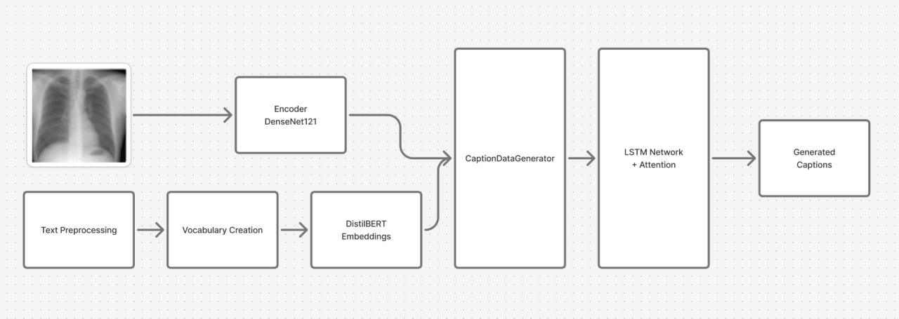

# 🩻 Chest X-ray Image Captioning & Pneumonia Detection

## 📖 Introduction

This project combines **medical image captioning** and **disease classification** to analyze chest X-ray images.
It leverages **deep learning** to:

* Generate **textual captions** summarizing radiology scans.
* Detect **pneumonia vs. normal cases** using transfer learning CNN models.

An interactive **Streamlit application** is provided for experimentation.

---

## 📑 Table of Contents

* [Features](#-features)
* [Methodology](#-methodology)
* [Workflow](#-workflow)
* [Pneumonia Detection](#-pneumonia-detection)
* [Installation](#-installation)
* [Usage](#-usage)
* [Parameters](#-parameters)
* [File Structure](#-file-structure)
* [Requirements](#-requirements)
* [Datasets & References](#-datasets--references)
* [Contributors](#-contributors)
* [License](#-license)

---

## ✨ Features

* 🖼 Upload **chest X-rays** and receive AI-generated captions.
* ⚕️ Detect **pneumonia vs. normal** conditions.
* 🔎 Adjustable caption generation parameters (max words, temperature, top-K).
* 🧠 Uses **DenseNet121 + DistilBERT + LSTM with Attention** for captioning.
* 📊 Includes **performance comparisons** of multiple CNN models.

---

## 🧠 Methodology

The captioning pipeline integrates **vision + language models** to generate clinically relevant captions.



### 🔎 Workflow Explanation

1. **Image Feature Extraction (DenseNet121)** → extracts anatomical features.
2. **Text Preprocessing & Vocabulary** → cleans reports and builds vocabulary.
3. **DistilBERT Embeddings** → encodes semantic information from text.
4. **CaptionDataGenerator** → aligns image + text pairs for training.
5. **LSTM + Attention Decoder** → generates captions word by word.
6. **Output** → final medical description.

---

## 🔄 Workflow Overview

This project includes **two pipelines**:


* **Captioning System**:

  * Input: Chest X-ray image
  * Process: DenseNet + DistilBERT + LSTM
  * Output: Textual impression

* **Pneumonia Detection**:

  * Input: Chest X-ray image
  * Process: Transfer Learning CNN
  * Output: Pneumonia / Normal classification

---

## 🩺 Pneumonia Detection

Several CNN architectures were evaluated for pneumonia classification.


* **MobileNetV2** achieved the highest accuracy (\~81%).
* CNN, ResNet50, and VGG16 also performed competitively.

---

## 🛠 Installation

```bash
git clone https://github.com/NufalXBaalash/Chest_X-ray_Image_Captioning.git
cd Chest_X-ray_Image_Captioning
pip install -r requirements.txt
```

---

## 🚀 Usage

1. Ensure required files are in the directory:

   * `model.keras` → trained captioning model
   * `wordtoix.pkl`, `ixtoword.pkl` → word-index mappings
   * `encodings.pkl` (optional, for faster inference)

2. Run the Streamlit app:

```bash
streamlit run app.py
```

3. Open `http://localhost:8501` in your browser.

---

## ⚙️ Parameters

* **Maximum Words** → limit caption length (5–50)
* **Temperature** → randomness (0.1–2.0)
* **Top-K Sampling** → restrict vocabulary choices

---

## 📂 File Structure

```
Chest_X-ray_Image_Captioning/
├── app.py                # Streamlit web app
├── model.keras           # Pre-trained captioning model
├── wordtoix.pkl          # Word-to-index mapping
├── ixtoword.pkl          # Index-to-word mapping
├── encodings.pkl         # Optional pre-computed encodings
├── requirements.txt      # Dependencies
└── README.md             # Project documentation
```

---

## 📦 Requirements

* Python 3.7+
* TensorFlow 2.10+
* Streamlit 1.28+
* Other dependencies in `requirements.txt`

---

## 📚 Datasets & References

### 📊 Datasets

* [CheXNet Weights](https://www.kaggle.com/datasets/sinamhd9/chexnet-weights)
* [Indiana University Chest X-rays](https://www.kaggle.com/datasets/raddar/chest-xrays-indiana-university)

### 📓 Notebooks

* [Image Captioning Chest X-rays (Kaggle)](https://www.kaggle.com/code/ebrahimelgazar/image-captioning-chest-x-rays)

### 📖 Research Papers

* *Show, Attend and Tell: Neural Image Caption Generation with Visual Attention* (arXiv:1502.03044)
* *CheXNet: Radiologist-Level Pneumonia Detection on Chest X-Rays with Deep Learning* (arXiv:1711.05225)

---

## 👨‍💻 Contributors

* **[Nufal X. Baalash](https://github.com/NufalXBaalash)**

---

## 📜 License

This project is licensed under the **MIT License**.

---

✅ This version has all your diagrams, results, datasets, and references integrated in a **professional research-style README**.

Do you want me to also **add a “Disclaimer” section** (e.g., “This project is for research/educational purposes only, not for clinical use”)?
